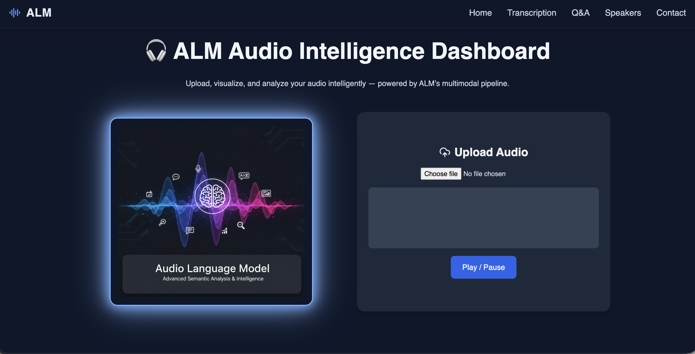

# 🎧 Audio Language Model (ALM)


**Audio Language Model (ALM)** is an advanced AI-powered system designed to **understand, analyze, and reason over audio conversations**.
It integrates **speech recognition, speaker diarization, audio event detection, emotion/paralinguistic analysis and contextual reasoning**  into a unified pipeline for intelligent audio understanding.

The system provides an **interactive dashboard** where users can upload audio files, visualize waveforms, generate transcriptions, analyze speakers, and ask questions about the audio content.

---

#  Features

 **Audio Upload & Visualization :**
Upload audio files and preview them with an interactive waveform visualizer.

 **Speech-to-Text Transcription :**
Convert audio recordings into accurate textual transcripts.

 **Speaker Diarization :**
Identify and separate multiple speakers within an audio conversation.

 **Speaker Analytics Dashboard :**
Visualize speaker distribution and conversation patterns.

  **Emotion & Paralinguistic Analysis :**
Analyze vocal cues such as tone, pitch, energy, and emotion to understand speaker sentiment and conversational context.


 **Audio Question Answering (Q&A) :**
Ask contextual questions about the uploaded audio.

 **Real-Time Audio Processing Pipeline**

---

#  System Architecture

```
Audio Stream
    │
    ▼
Audio Chunker (pydub + ffmpeg)
    │
    ▼
    ├──► ASR Processor        
    ├──► Diarization          
    ├──► Emotion              
    └──► Event Detection      
              │
              ▼
         Fusion Engine        (Confidence-Weighted Multimodal Fusion)
              │
              ▼
         Reasoner             
              │
              ▼
    Context-Aware Summary
```
---

# 🖥 Dashboard 



The ALM dashboard provides an interactive interface for analyzing audio intelligence.

###  Home

* Upload audio files
* Preview waveform
* Play or pause audio

###  Transcription

* Generate transcripts from audio
* Display speaker-separated dialogue
* Download transcript file

### ❓ Q&A

* Ask questions about audio content
* Get AI-generated contextual answers

###  Speaker Analysis

* Visualize speaker participation
* Display conversation distribution charts

---

# 📂 Project Structure

```
Audio_Language_Model/
│
├── ALMModel_3.ipynb        # Backend AI processing pipeline
├── index.html              # Interactive dashboard UI
├── AL.png                  # Project banner image
└── README.md               # Project documentation
```

---

#  Technologies Used

## AI/ML

* Whisper / WhisperX — Speech Recognition
* Pyannote — Speaker Diarization
* Transformers — Natural Language Reasoning
* PyTorch — Deep Learning Framework

## Frontend

* HTML
* CSS

## Backend

* Python
* Flask API
* Async Audio Processing

---

#  Installation

Clone the repository:

```
git clone https://github.com/nitishkumar1407/Audio_Language_Model.git
cd Audio_Language_Model
```

Install required Python dependencies:

```
pip install torch torchaudio transformers flask pyannote.audio
```

Run the backend notebook or server.

---

#  Usage

1️⃣ Start the backend audio processing pipeline.

2️⃣ Open the dashboard interface:

```
index.html
```

3️⃣ Upload an audio file.

4️⃣ Run transcription analysis.

5️⃣ Explore speaker insights and ask questions about the audio.

---

#  Future Improvements

* Real-time streaming audio processing
* Multilingual speech understanding
* Emotion-aware conversational analysis
* Edge-device optimized inference
* Integration with advanced LLM reasoning systems

---

#  Contribution

Contributions are welcome!

Steps to contribute:

1. Fork the repository
2. Create a new feature branch
3. Commit your changes
4. Push to the branch
5. Submit a Pull Request

---


